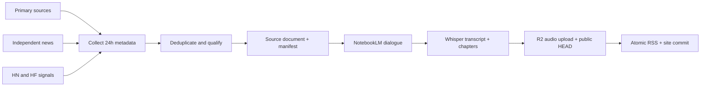

# AI Builder Brief

Three to five source-linked AI developments before stand-up, produced as an approximately six-minute English NotebookLM dialogue every day.

AI Builder Brief is a production reference show for [CastForge](https://github.com/lifan-builds/castforge). Its differentiator is not generic AI-news generation: every selected story has an authoritative primary source or two independent reports, and every episode publishes its source manifest, transcript, and chapters.

The public feed opens after seven successful production shadow runs. The repository can already run its complete fixture pipeline offline.

## Offline proof

```bash
python3 -m venv .venv
.venv/bin/pip install -e ".[test]"
.venv/bin/python -m ai_builder_brief run --fixture --date 2026-08-11
```

This writes a local feed, source document, qualified episode manifest, transcript, chapters, and site under `build/fixture/`. The unverified trend-only fixture is excluded.

## Production flow



The production command is:

```bash
.venv/bin/python -m ai_builder_brief run --date YYYY-MM-DD
```

GitHub Actions makes three effective attempts at 6, 8, and 10 AM Pacific, with a local-time gate that handles daylight saving changes. The feed GUID and R2 object key are date-based, so the first success publishes and later attempts skip.

## Sources

The initial source set is declared in [`sources.yaml`](sources.yaml):

- official feeds and announcement pages from OpenAI, Anthropic, Google DeepMind, Google AI, Meta AI, Mistral, Microsoft Research, NVIDIA, and Hugging Face;
- arXiv AI/ML/CL feeds, Hugging Face Daily Papers, trending model cards, and selected open-source release feeds;
- independent reporting from TechCrunch, Ars Technica, MIT Technology Review, and The Verge;
- Hacker News and Techmeme as trend signals only.

Reddit and newsletter summaries are not ingested. RSS summaries and page metadata are used; the pipeline does not scrape or republish full articles or paywalled text. See [SOURCE_POLICY.md](SOURCE_POLICY.md).

## Production setup

1. Install the show with transcription support: `pip install -e ".[transcription]"`. The project pins the published `castforge==0.1.1` package.
2. Complete `notebooklm login` on the self-hosted runner.
3. Set `NOTEBOOKLM_NOTEBOOK_ID`, `R2_ACCESS_KEY_ID`, and `R2_SECRET_ACCESS_KEY` as GitHub secrets.
4. Keep the configured R2 endpoint and public audio origin in [`podcast.yaml`](podcast.yaml); replace them only when moving the show to another Cloudflare account or custom domain.
   The configured OP3 enclosure prefix provides aggregate, privacy-respecting download measurement while R2 remains the validated origin.
5. Leave `PUBLICATION_ENABLED` unset while the 6 AM Pacific schedule accumulates one private shadow per day.
6. Review seven successful shadows, then set `PUBLICATION_ENABLED` to `true`; the same schedule switches to public 6/8/10 AM attempts.
7. Enable GitHub Pages from `docs/` and submit `docs/feed.xml` to podcast directories.

Any evidence, audio, transcript, R2, public-MIME, or byte-length failure occurs before the RSS commit point.
The R2 publisher also refuses any upload that would take the bucket above 9 GB, leaving a 1 GB margin below the free 10 GB allowance without deleting historical audio.

## Development

```bash
python -m pytest
python -m ai_builder_brief run --fixture --date 2026-08-11
```

The ordinary test suite is offline. Live source, NotebookLM, transcription-model, R2, and podcast-directory checks require explicit production credentials.

## Project documents

- [ARCHITECTURE.md](ARCHITECTURE.md) — boundaries and fail-closed data flow
- [OPERATIONS.md](OPERATIONS.md) — shadow, publication, incident, and correction procedures
- [SHADOW_RUNS.md](SHADOW_RUNS.md) — real production-shadow evidence and launch-gate status
- [SOURCE_POLICY.md](SOURCE_POLICY.md) — source eligibility and content-use rules
- [PROMOTION.md](PROMOTION.md) — staggered launch material and channel mapping
- [METRICS.md](METRICS.md) — adoption, listener, and quality definitions

## License

MIT
